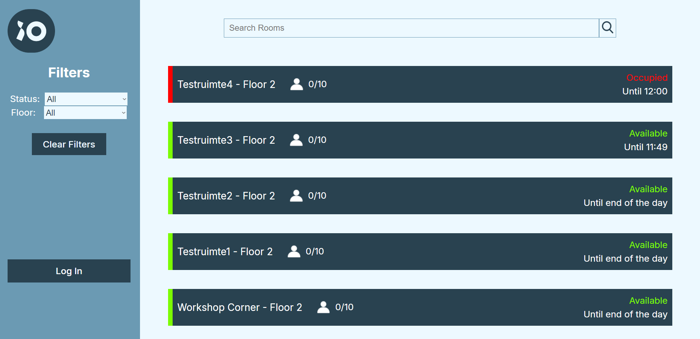

# iO Room Usage Detection

A platform that shows which meeting rooms are actually in use, compares that with what was booked in Microsoft 365, and recommends better-sized rooms for recurring meetings.

Built by a student team as a client project for **iO**, with a Java / Spring Boot backend, a React dashboard, and a camera-based people-detection service for edge devices.

## The problem

Calendars show what was *planned*. Offices end up with rooms that are booked but empty, and large rooms used by two people. This project measures real occupancy and feeds it back into room planning.

## How it works

```
Camera + people detector (edge)        Microsoft 365 (Graph API)
        |  POST /cameras                      |  rooms, calendars, events
        v                                     v
            Spring Boot backend  <---->  MySQL (Flyway migrations)
              |  REST + OpenAPI
              v
          React dashboard        Mailjet (absent-organiser email)
```

- **Edge detector** (`Hardware/RaspberryBackend`): a Java service that runs a MobileNet-SSD people detector through OpenCV and posts the people count to the backend, identified by the device's MAC address.
- **Backend** (`BackEnd`): layered Spring Boot API with one use-case class per operation, JPA persistence, Flyway migrations and Swagger UI.
- **Microsoft 365 integration:** reads room calendars and events through Microsoft Graph.
- **Recommendations:** for a recurring meeting series, if at least half of the past meetings used less than 60% of the room's capacity, the backend proposes smaller rooms that are free at the series' times.
- **Automation:** a scheduler runs every minute and looks for meetings that are about to end. It emails the organiser through Mailjet when nobody was detected, or when attendance stayed under 60% of the room's capacity (in that case with recommended rooms).
- **Dashboard** (`FrontEnd`): React + Vite app with room search, status and floor filters, and room detail and update pages.

## Screenshots




## API overview

| Method | Path | Purpose |
| --- | --- | --- |
| GET | `/rooms`, `/rooms/{roomId}`, `/rooms/email/{roomEmail}` | list and read rooms |
| POST | `/rooms` | create a room |
| GET | `/events/{roomId}`, `/events/email/{roomEmail}` | events for a room |
| POST / GET | `/cameras` | register a camera connection, list connections |

Interactive docs are served by springdoc at `/swagger-ui.html` when the backend runs.

## Running it

**Requirements:** Java 17, Node 18+, and a MySQL database for real runs. The tests use an in-memory H2 database.

**Backend**

```bash
cd BackEnd
cp src/main/resources/application-staging.properties.example src/main/resources/application-staging.properties
# fill in your database URL and credentials, then set the Microsoft Graph and Mailjet variables below
./gradlew bootRun --args='--spring.profiles.active=staging'
./gradlew test
```

Secrets are read from configuration and are never committed:

- Mailjet: environment variables `MJ_APIKEY_PUBLIC` and `MJ_APIKEY_PRIVATE`.
- Microsoft Graph: the properties `azure.client-id`, `azure.tenant-id` and `azure.client-secret` (or the matching environment variables) for an Azure app registration.

**Frontend**

```bash
cd FrontEnd
npm install
npm run dev
```

**Edge detector:** see `Hardware/RaspberryBackend`. It expects the model files in `models/` and posts to the backend URL set in `Main.java`; change that constant to your server address.

## Tests and delivery

- JUnit tests for use cases and controllers, including camera-connection creation, room listing and room recommendations.
- Dockerfiles for the backend and the edge service.
- Six Flyway migrations version the schema (cameras, meeting rooms, reservations, series-master ids).

## Known limitations

- The login page is a client-side placeholder with a hard-coded password. It is not real authentication and must be replaced before any real deployment.
- The edge service has a temporary server address hard-coded in `Main.java`.

## Tech stack

Java 17, Spring Boot 3.3, Spring Data JPA, MySQL, Flyway, springdoc-openapi, Microsoft Graph SDK, Mailjet, React 18, Vite, Axios, OpenCV, MobileNet-SSD, Docker, JUnit, H2.

## Team and my contribution

This was a two-person team project by **Nikolay Mizov** and **Ivan Tsankov**.

**Nikolay's contribution:**
- The camera-based people detection (`Hardware/RaspberryBackend`, MobileNet-SSD through OpenCV).
- The live room dashboard (`FrontEnd`).

Other parts of the system, including the Raspberry Pi device setup and the hiding of people's identities in the camera preview, were done by teammates.

Built for a client and published with the project team's agreement.

## Acknowledgements

Commissioned by iO as part of a Fontys University of Applied Sciences project. iO and Fontys names and logos belong to their owners.
